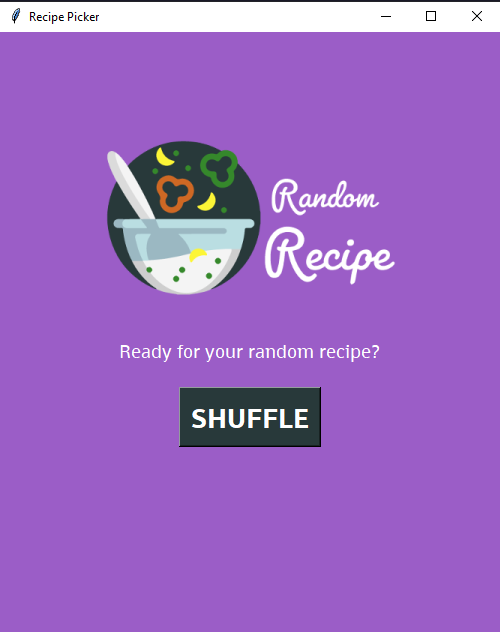

# Recipe Picker - Random recipes at just one click

# **INDEX**

## Project Description

Recipe Picker is an app created on Python and based on the YouTube tutorials from the channel "Python Simplified" (YouTube Channel: ***https://www.youtube.com/@PythonSimplified***) this is a simple app that gives the user random recipes from around the world with just one click, here is a example of the app:

### Download and Installation

To download and install `RecipePicker` follow these instructions:

- Go to: ***https://drive.google.com/drive/folders/107K9P-1v5ZQQEiC8FlADq0NlEadK1AM_?usp=sharing***.
- Download the .exe file and open it, if it was downloaded as a .zip file, decompress and then click on the .exe file.
- Follow the instructions on the wizard, when finished open the app and it should work perfectly.

### Technologies Used

This project used the following technologies and packages, you can find them inside the `requirements.txt` for an easy installation.

- `Tkinter`: The main Python library for the creation of GUI, this is the main package in this project.
- `PIL`: `Python Imaging Library` for short `PIL` is the package used to load all the images used on the application.
- `SQLite3`: The database where all the information related to the recipes is stored, such as the recipe name, the ingredients, quantities and units.
- `Numpy`: Used to randomly select the recipes.
- `sys` and `os`: Used to obtain all the resources used like images, fonts and the database.
- `PyInsataller`: To create the .exe of the app

## Contributions

You are free to contribute to this project, for this reason I leave below the contribution process and a series of guidelines for the contributors:

### Contribution Process

Here is a list of the things that you should do to contribute to this project:

- Fork this repository and clone it to your local machine.
- Create a new branch for you contribution using: git checkout -b "the name of your contribution".
- Make the necessary changes and improvements on your local branch.
- Make sure to follow a style guideline and maintain a code consistency.
- Commit your changes using: git commit -m "commit description".
- Open a pull request so I can review your changes.

### Contribution Guidelines

- Please maintain a respectful and friendly tone in all interactions related to this project.
- If you're reporting a bug, provide detailed information on how to reproduce it.
- If you're proposing a new feature, explain its usefulness and provide code examples if possible.
- Whenever possible, include unit tests or integration tests to support your changes.
- I appreciate your time and contributions to make this project better. I look forward to your participation!

## LICENSE

This project is created under the MIT License. Consult the LICENSE file for more details.

## Gratitudes

I want to show my gratitude to Python Simplified fo the sereies of videos made of the topic, videos that helped me to be able to recreate the same app, but adding some new tweaks that made the project a little bit better, I leave all the information related to Python Simplified.

- Python Simplified YouTube Channel: https://www.youtube.com/@PythonSimplified.
- Python Simplified GitHub Profile: https://github.com/MariyaSha.
- Python Simplified Discord Server: https://discord.com/invite/wgTTmsWmXA.